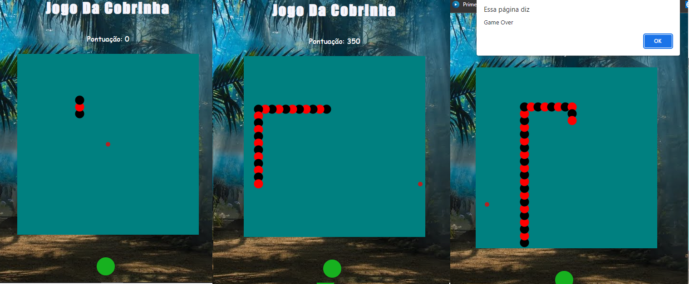

🐍 SnakeEyes 🐍

    
     

 ## Sobre o Desenvolvimento: 
 
  Foi desenvolvido o famoso jogo da cobrinha no SENAI de São José, no curso de Desenvolvimento de Sistema. Professor: [Rodrigo Farias](https://github.com/rodrigofarias08)  Alunos: [Alexsander Marchi Zunino](https://www.linkedin.com/in/alexsander-marchi-zunino-226332170/), [Gustavo Guglielmi](https://github.com/GustavoGuglielmi) e [João Freitas](https://github.com/joaaovfr). Foram usados: 
  - Métodos (.Pop, Unshift...)
  - Funções
  - Vetores
  - Canvas para o estilo
  
  Dificuldades: criar uma função em que a cauda segue o movimento anterior da cauda a sua frente, muitas vezes ficando espelhadas na posição atual.

  Nota: Evoluindo a cada dia, a gente olha o código e ve que poderia criar hoje em dia de uma forma mais rápida e com menos linhas, mas ver a evolução do começo até hoje é imprescritível.

   ##

 ## Historia do jogo:

 Ele foi lançado no dia 10 de Novembro de 1997 com o Nokia 6110 e incorporado/adaptado à plataformas móveis. Atigindo grande sucesso, o jogo foi seguido por outras 8 versões do game que sucederam acompanhando a evolução dos dispositivos.

 Na época do lançamento, o joguinho, por mais simples que fosse, mostrou que os aparelhos celulares poderiam ser usados para mais coisas além de fazer chamadas telefônicas em movimento. Portanto, ele acabou por desempenhar um papel fundamental – juntamente com as mensagens de texto – na construção do telefone celular como um instrumento de mudança social.

 Curiosidade: Até hoje o Snake continua sendo um dos jogos mais famosos da história: Por exemplo, na Finlândia, existe uma competição oficial para jogar o game onde os jogadores se desafiam para fazer o maior número de pontos possíveis.

   ##